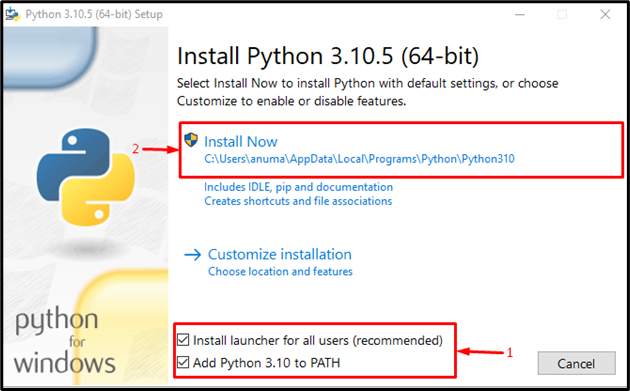

# Python

---


---
# O que é Python?

Python é uma linguagem de programação de alto nível, interpretada e de propósito geral, que suporta múltiplos paradigmas, incluindo programação orientada a objetos (OOP), programação imperativa e programação funcional.

Ela foi criada por [Guido van Rossum](https://pt.wikipedia.org/wiki/Guido_van_Rossum) e lançada pela primeira vez em 1991. Python é conhecida por sua sintaxe clara e legível, o que a torna uma escolha popular para iniciantes e desenvolvedores experientes.

Python é uma das linguagens de programação mais populares do mundo, com uma vasta comunidade e uma enorme variedade de bibliotecas e frameworks, sendo amplamente utilizado em desenvolvimento web, ciência de dados, machine learning, automação, scripting, desenvolvimento de jogos, computação científica e desenvolvimento de software, com exemplos famosos como Instagram, Spotify, Dropbox e Reddit.
# Por que aprender Python?

Python é uma linguagem de programação versátil e poderosa, com uma sintaxe simples e fácil de aprender. Aqui estão algumas razões pelas quais você deve considerar aprender Python:

- Aumenta suas oportunidades de carreira em diversas áreas como desenvolvimento web, ciência de dados, automação, e mais.
- Melhora suas habilidades de resolução de problemas e lógica de programação.
- Facilita a entrada no mundo da programação devido à sua sintaxe simples e legível.
- Permite a criação de projetos pessoais e profissionais de forma rápida e eficiente.
- Proporciona acesso a uma grande comunidade de suporte e recursos educacionais.

Fontes:
- [Python.org](https://www.python.org/doc/essays/blurb/)
- [Real Python](https://realpython.com/tutorials/basics/)
- [Stack Overflow Developer Survey 2023](https://insights.stackoverflow.com/survey/2023#technology-most-popular-technologies)

# Instalando Python

## Pré-requisitos

- **Sistema Operacional**: Windows, macOS ou Linux.

### Python no Linux

Para instalar o Python no **Linux**, você pode usar o gerenciador de pacotes da sua distribuição. Aqui estão alguns exemplos:

- **Debian/Ubuntu**:

```shell
  sudo apt update && sudo apt install python3
```

- **Fedora**:

```shell
  sudo dnf install python3
```

- **Arch Linux**:

```shell
  sudo pacman -S python
```

- **openSUSE**:

```shell
  sudo zypper install python3
```

### Python no Windows

Para instalar o Python no **Windows**, você precisa acessar o [site oficial da linguagem](https://www.python.org/downloads/), e em seguida clique em "Download Python \(Última versão lançada\)".

Em seguida, ao inicializar o instalador, vai ser exibido a janela para instalar o Python, mas antes de fato instalar, é importante adicionar o Python no "PATH", pois caso contrário, não será possível executá-lo na máquina local.



Após a instalação, entre no **command prompt** e para certificar de que a linguagem está instalada, é possível verificar usando o comando:

```cmd
    python -v
```

Caso o terminal retorne a mensagem de confirmação da versão, significa que o Python está instalado e pronto pra ser usado.

### Python no macOS

Para instalar o Python no **macOS**, você pode usar o gerenciador de pacotes Homebrew. Se você não tem o Homebrew instalado, você pode instalá-lo com o seguinte comando:

```shell
  /bin/bash -c "$(curl -fsSL https://raw.githubusercontent.com/Homebrew/install/HEAD/install.sh)"
```

Depois de instalar o Homebrew, você pode instalar o Python com o seguinte comando:

```shell
  brew install python
```

# Executando um script Python

Para executar um script Python, crie um arquivo com a extensão _.py_, por exemplo, `hello.py`, e adicione o código abaixo:

```python
print("Hello, World!")
```

Em seguida, abra o terminal, navegue até o diretório onde o arquivo está salvo e execute o comando:

```shell
    python hello.py
```

Caso o Python esteja instalado corretamente, você verá a saída:

```
Hello, World!
```